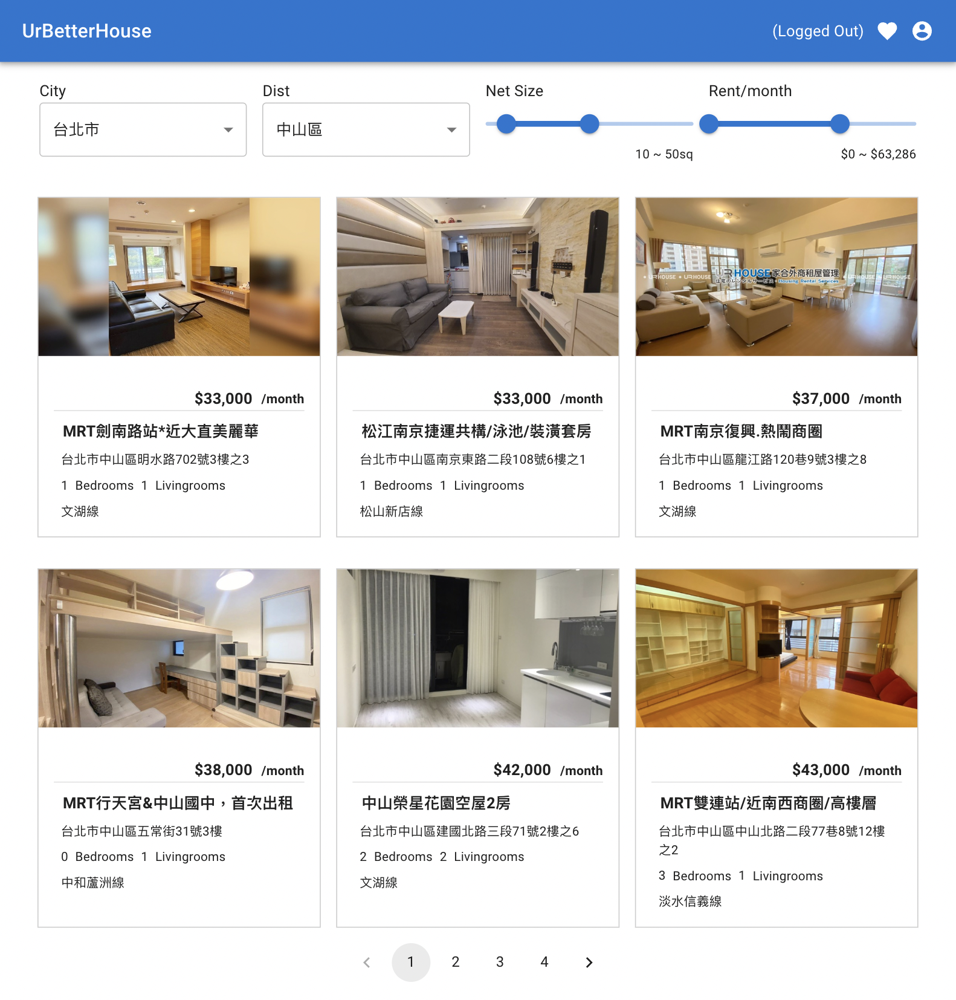

# UrBetterHouse Project

A house marketplace PoC written in Ruby on Rails. (Online Demo)[https://ur-better-house-2.herokuapp.com/]



## Requirements

* Ruby 2.7.2
* Rails 6.0.5
* Node 12.22.12
* Yarn 1.22.19

## Installation

```bash
# rails db:migrate
# rails scraper:ur_house
# rails ur_better_house:demo_accounts
```

## Demo Account

* role: admin
  * email: zeus@somemail.com
  * password: isthat2022

* role: user
  * email: meme@somemail.com
  * password: isthat2022

Due to token authentication system, each account has only one valid session at a time.
If the login user has "admin" role, the UI AppBar will reveal in purple, so that can
edit properties.

## Before deploy to Heroku

If using Travis-ci/cd solution, don't forget to set HEROKU_API_KEY, HEROKU_APP,
and HEROKU_BRANCH in Travis project settings.

Make sure you have NodeJS buildpack added, otherwise the engine in package.json
will take no effect.

```bash
# heroku buildpacks:add heroku/nodejs
# heroku buildpacks:add heroku/ruby
```

and then import data seed as "Installation" part above:

```bash
# heroku run -a APP_NAME rails db:migrate
# heroku run -a APP_NAME rails scraper:ur_house
# heroku run -a APP_NAME rails ur_better_house:demo_accounts
```

## Development Journal

This project was assumed to be a quick mockup / prototype, so that the main objective
is to make sure the whole project is **workable** for this situation. 

The main components of this project:

* Ruby on Rails 6
  * For balance of stability and usability, current version (7.x) is not the candidate.
  
* Devise
  * Basic authentication system of RoR

* GrapeAPI
  * For some reasons, I personally use Sinatra/Datamapper for web API development
    instead of RoR more often. Therefore, GrapeAPI is unfamiliar for me. Nevertheless, the
    usage of GrapeAPI was recommended, so I decide to try using it in this project.

* Travis CI/CD
  * The quick CI/CD solution

* Heroku
  * Although the surprisingly expansive in large scale, it's the best solution for small
    project / demo.


### Problems Tackled

* Web Scraping
  * When writing scraper of UrHouse, it was supposed to fetch the raw HTML and parse.
    So I choose a gem called **Wombat** which provides good DSL for code readability but
    now currently not maintained by project owner though. However, I shortly found out the
    origin UrHouse web application provides an AJAX for full data without limitation. In this
    way, instead of Wombat, I decide on using the gem **Oj** for the best JSON parsing
    performance. The task is in ```lib/tasks/scraper.rake```.
* Authentication System with API
  * Web API is _stateless_ in contrast with Web Application. For this reason, I have choose a gem
    called **devise-token_authenticatable** to make sure we'll get an authentication token after
    logged in. Despite it can only generate one token at a time so multiple sessions are not
    available.
* Grape Entity with Many-to-Many Relationship
  * The gem **grape-entity** provides exposing permitted attributes of data models in Grape API.
    When querying a list of residential with **user likes**, it has to be a many-to-many relationship
    between Residential and Favorite models. In fact, I'm not sure I used it properly but
    it seems work correctly. (in ```app/api/ur_better_house/api/V1.rb:15```)
* UI Design
  * This part seems liberated to work with. So for both time schedule and elegant user interface,
    I choose **MUI**, which is a combination of React and (Material Design)[https://material.io/design]
    in a nutshell. the component **ResidentialShowcase** in ```app/javascript/packs/``` is designed
    to display a specified residential. Furthermore, it can directly edit properties by clicking
    them in this component if logged in user is **admin**, which is hardcoded in the _role_ attribute of
    User model.
* Deployment
  * The most strange problem I've encounter is in the deployment stage. If the ENV variables are
    not found when using them for database connection establishment, PG::Error will be caught
    in the gem ```pg``` itself, and cause another Exception inside the ```catch``` block. Without error
    messages about databse connection, it only puts one line without traceback
     ```TypeError (no implicit conversion of nil into String)```.
    It takes about 2 days to work with. This should treat as a bug in ```pg``` gem. However it was
    luckily resolved finally.
